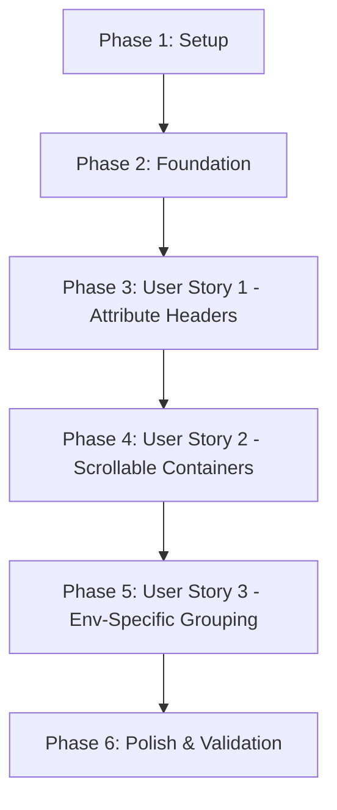

# Tasks: Multi-Environment Comparison UI Improvements

**Feature**: 006-comparison-ui-improvements  
**Input**: Design documents from `specs/006-comparison-ui-improvements/`  
**Prerequisites**: plan.md, spec.md, research.md, data-model.md, contracts/, quickstart.md

## Overview

This feature improves multi-environment comparison HTML reports with:
- Attribute headers with improved spacing (P1)
- Scrollable value containers for large content (P1)
- Environment-specific resource grouping (P2)

**Implementation Strategy**: MVP-first approach - implement P1 stories first (attribute headers, scrollable containers), then P2 (environment-specific grouping). Each story is independently testable and deliverable.

**Total Tasks**: 70 tasks across 6 phases  
**Estimated Time**: 10 hours total

---

## Format: `[ID] [P?] [Story] Description`

- **[P]**: Can run in parallel (different files, no dependencies)
- **[Story]**: Which user story this task belongs to (US1, US2, US3)
- Include exact file paths in descriptions

---

## Phase 1: Setup (Shared Infrastructure)

**Purpose**: Prepare development environment and baseline testing

- [ ] T001 Verify Python 3.9.6+ virtual environment is activated
- [ ] T002 Confirm tf-plan-analyzer package installed via `pip install -e .`
- [ ] T003 [P] Locate real Terraform plan files for testing: tfplan-test-2.json and tfplan-prod.json
- [ ] T004 [P] Run baseline comparison to validate current behavior: `tf-plan-analyzer compare --html /Users/danielhendrickson/workspace/promega/gsp-infrastructure-tf/2_deployApp/tfplan-test-2.json /Users/danielhendrickson/workspace/promega/tmp/tfplan-prod.json --output baseline-v1.html`
- [ ] T005 Review baseline HTML report to understand current table-based layout and identify improvement areas

**Completion Criteria**: Environment ready, baseline report generated, all prerequisites confirmed

---

## Phase 2: Foundational Tasks (Blocking Prerequisites)

**Purpose**: Core CSS infrastructure needed by all user stories

- [ ] T006 Review docs/style-guide.md for existing color palette and spacing values
- [ ] T007 Review docs/function-glossary.md for `generate_full_styles()` function signature
- [ ] T008 Review src/core/multi_env_comparator.py to understand current `_render_attribute_table()` implementation (lines ~811-920)
- [ ] T009 Review src/lib/html_generation.py to understand current CSS generation pattern

**Completion Criteria**: Development team understands existing codebase structure and CSS patterns

---

## Phase 3: User Story 1 - Attribute Headers with Improved Spacing (P1)

**Story Goal**: Transform attribute table rows into header-based sections with flexbox layout for better readability and horizontal spacing.

**Independent Test**: Generate comparison report with 10+ resources, verify each attribute appears as H3 header with 30px spacing between sections.

**Acceptance Criteria**:
- Each attribute name appears as `<h3>` with `.attribute-header` class (not table cell)
- Minimum 30px vertical spacing between consecutive attribute sections
- Attribute names fully visible without truncation
- Environment columns aligned horizontally with flexbox
- Existing diff highlighting preserved

### Tasks

- [ ] T010 [US1] Add `get_attribute_section_css()` function to src/lib/html_generation.py with styles for `.attribute-section`, `.attribute-header`, `.attribute-values`, `.env-value-column`, `.env-label`
- [ ] T011 [US1] Update `generate_full_styles()` in src/lib/html_generation.py to include `get_attribute_section_css()` in returned stylesheet
- [ ] T012 [US1] Modify `_render_attribute_table()` in src/core/multi_env_comparator.py to replace `<table>` structure with `
` wrappers
- [ ] T013 [US1] Update attribute name rendering from `<td>` to `<h3 class="attribute-header"><code>{attr_name}</code></h3>` in src/core/multi_env_comparator.py
- [ ] T014 [US1] Replace table row structure with `
` flexbox container in src/core/multi_env_comparator.py
- [ ] T015 [US1] Update environment value rendering to use `
` with `
` and value div in src/core/multi_env_comparator.py
- [ ] T016 [US1] Preserve sensitive badge rendering (`🔒 SENSITIVE`) within new attribute header structure
- [ ] T017 [US1] Generate test comparison report: `tf-plan-analyzer compare --html --output test-story1.html /Users/danielhendrickson/workspace/promega/gsp-infrastructure-tf/2_deployApp/tfplan-test-2.json /Users/danielhendrickson/workspace/promega/tmp/tfplan-prod.json`
- [ ] T018 [US1] Validate Story 1 acceptance criteria in browser: attribute headers visible, 30px spacing, no truncation, flexbox layout working
- [ ] T019 [US1] Run existing test suite to ensure no regressions: `pytest tests/test_multi_env_unit.py -v`
- [ ] T020 [US1] Commit Story 1 changes with message: "Implement attribute headers with improved spacing (Story 1)"

**Story 1 Completion Criteria**: All T010-T020 complete, attribute headers working, tests passing, committed to git

---

## Phase 4: User Story 2 - Scrollable Value Containers (P1)

**Story Goal**: Add scrollbars to value containers for large JSON objects and long strings, preventing page layout breakage.

**Independent Test**: Compare plans with large JSON objects (100+ lines) and long strings (500+ characters), verify containers have independent scrollbars.

**Acceptance Criteria**:
- Values >400px height show vertical scrollbar
- Values >600px width show horizontal scrollbar
- Values <400px height do NOT show scrollbar (overflow: auto behavior)
- Scrolling one container doesn't affect others
- Diff highlighting visible inside containers
- Environment headers stick when scrolling vertically

### Tasks

- [ ] T021 [US2] Add `get_scrollable_container_css()` function to src/lib/html_generation.py with `.value-container` styles (max-height: 400px, max-width: 600px, overflow: auto)
- [ ] T022 [P] [US2] Add `get_sticky_header_css()` function to src/lib/html_generation.py with `.env-headers`, `.env-header`, `.sticky-header` styles (position: sticky, top: 0, z-index: 10)
- [ ] T023 [US2] Update `generate_full_styles()` in src/lib/html_generation.py to include `get_scrollable_container_css()` and `get_sticky_header_css()`
- [ ] T024 [US2] Wrap value rendering in `
` in src/core/multi_env_comparator.py `_render_attribute_table()` function
- [ ] T025 [US2] Add sticky environment headers `
` before attribute sections in src/core/multi_env_comparator.py
- [ ] T026 [US2] Loop through env_labels to create `
{env_label}
` for each environment
- [ ] T027 [US2] Ensure diff highlighting classes (baseline-removed, baseline-added, char-removed, char-added) work inside `.value-container` divs
- [ ] T028 [US2] Add optional webkit scrollbar styling for better UX in src/lib/html_generation.py
- [ ] T029 [US2] Generate test comparison with large values: `tf-plan-analyzer compare --html --output test-story2.html /Users/danielhendrickson/workspace/promega/gsp-infrastructure-tf/2_deployApp/tfplan-test-2.json /Users/danielhendrickson/workspace/promega/tmp/tfplan-prod.json`
- [ ] T030 [US2] Validate Story 2 acceptance criteria: scrollbars appear only when needed, sticky headers work, diff highlighting preserved
- [ ] T031 [US2] Test scrollbar behavior with edge cases: values exactly at 400px threshold, nested JSON objects, very long strings
- [ ] T032 [US2] Run test suite to ensure backward compatibility: `pytest tests/ -v`
- [ ] T033 [US2] Commit Story 2 changes with message: "Implement scrollable value containers with sticky headers (Story 2)"

**Story 2 Completion Criteria**: All T021-T033 complete, scrollable containers working, sticky headers functional, tests passing, committed to git

---

## Phase 5: User Story 3 - Environment-Specific Resource Grouping (P2)

**Story Goal**: Separate and visually distinguish resources that exist in only some environments to reduce clutter and improve drift detection.

**Independent Test**: Compare environments where Test has 5+ resources not in Production, verify resources clearly marked and grouped in separate collapsible section.

**Acceptance Criteria**:
- Resources in only some environments grouped in collapsible `
` section at bottom
- Section expanded by default (`
`)
- Each env-specific resource has amber warning badge showing which environments
- Presence info shows "Present in:" and "Missing from:" for each resource
- Regular resources (in all environments) remain in main section
- Section can be collapsed/expanded via keyboard (Space/Enter)

### Tasks

- [ ] T034 [US3] Add `get_env_specific_section_css()` function to src/lib/html_generation.py with styles for `.env-specific-section`, `.env-specific-header`, `.env-specific-content`, `.env-specific-badge`, `.resource-count`, `.presence-info`
- [ ] T035 [US3] Update `generate_full_styles()` in src/lib/html_generation.py to include `get_env_specific_section_css()`
- [ ] T036 [US3] In `generate_html_report()` method of src/core/multi_env_comparator.py, separate sorted_comparisons into two lists: regular_resources and env_specific_resources
- [ ] T037 [US3] Implement logic to check if `len(rc.is_present_in) < len(env_labels)` to determine env-specific resources
- [ ] T038 [US3] Render regular resources using existing `_render_resource_card()` loop
- [ ] T039 [US3] Add conditional block: if env_specific_resources, create `
` container
- [ ] T040 [US3] Add `
` with warning icon, title, and resource count badge
- [ ] T041 [US3] Loop through env_specific_resources to render each resource card with modifications
- [ ] T042 [US3] Add `.env-specific-badge` to resource header showing which environments contain the resource (e.g., "Test only" or "Present in: Test, Staging")
- [ ] T043 [US3] Add `.presence-info` div showing "Present in:" and "Missing from:" environment lists
- [ ] T044 [US3] Filter env_labels to only include environments where resource exists when calling `_render_attribute_table()`
- [ ] T045 [US3] Ensure collapsible section uses HTML5 `
` element (no JavaScript required)
- [ ] T046 [US3] Add custom toggle icon styling with CSS transitions (▼ when open, ▶ when collapsed)
- [ ] T047 [US3] Generate test comparison with env-specific resources: `tf-plan-analyzer compare --html --output test-story3.html /path/to/test-plan.json /path/to/prod-plan.json`
- [ ] T048 [US3] Validate Story 3 acceptance criteria: env-specific section visible, badges correct, collapsible works, presence info accurate
- [ ] T049 [US3] Test keyboard accessibility: Space/Enter toggle, Tab navigation through section
- [ ] T050 [US3] Test with edge case: all resources env-specific (none in multiple environments)
- [ ] T051 [US3] Run full test suite: `pytest tests/ -v`
- [ ] T052 [US3] Commit Story 3 changes with message: "Implement environment-specific resource grouping (Story 3)"

**Story 3 Completion Criteria**: All T034-T052 complete, env-specific grouping working, collapsible section functional, tests passing, committed to git

---

## Phase 6: Final Polish & Cross-Cutting Concerns

**Purpose**: End-to-end validation, documentation updates, and final testing

- [ ] T053 Run comprehensive end-to-end test with real production plans: `tf-plan-analyzer compare --html --output prod-comparison-v2.html /Users/danielhendrickson/workspace/promega/gsp-infrastructure-tf/2_deployApp/tfplan-test-2.json /Users/danielhendrickson/workspace/promega/tmp/tfplan-prod.json`
- [ ] T054 Validate all 3 user stories work together: attribute headers, scrollable containers, env-specific grouping
- [ ] T055 Test with --diff-only flag to ensure env-specific resources still grouped correctly: `tf-plan-analyzer compare --html --diff-only --output diff-only-test.html plan1.json plan2.json`
- [ ] T056 Open generated HTML in multiple browsers: Chrome 90+, Firefox 88+, Safari 14+, Edge 90+ (if available)
- [ ] T057 Verify sticky headers work across browsers (position: sticky support)
- [ ] T058 Verify scrollable containers work across browsers (overflow: auto behavior)
- [ ] T059 Verify collapsible section works across browsers (HTML5 details support)
- [ ] T060 Test keyboard accessibility: Tab navigation, Space/Enter for collapsible section
- [ ] T061 Update docs/style-guide.md to document new CSS classes: `.attribute-section`, `.value-container`, `.sticky-header`, `.env-specific-section`, `.env-specific-badge`
- [ ] T062 Update docs/function-glossary.md to document modified functions: `_render_attribute_table()` (v2.0 structure), `_render_attribute_value()` (wrapped in container), `generate_full_styles()` (new CSS functions)
- [ ] T063 [P] Create unit tests for new HTML structure in tests/test_multi_env_unit.py
- [ ] T064 [P] Update existing assertions in tests/test_e2e_multi_env.py for new layout (replace `.attribute-table` with `.attribute-section`)
- [ ] T065 Run complete test suite with coverage: `pytest tests/ -v --cov=src --cov-report=html`
- [ ] T066 Validate test coverage for modified files: src/lib/html_generation.py, src/core/multi_env_comparator.py
- [ ] T067 Review generated HTML file size to ensure <20% increase from baseline (performance constraint)
- [ ] T068 Test report generation time with 200 resources to ensure <2 seconds (performance goal)
- [ ] T069 Commit documentation updates: "Update docs for UI improvements (feature 006)"
- [ ] T070 Create summary validation report comparing baseline-v1.html vs prod-comparison-v2.html

**Phase 6 Completion Criteria**: All acceptance criteria validated, documentation updated, tests passing, performance goals met

---

## Dependencies

### User Story Execution Order

**Critical Path**:
1. Setup (T001-T005) must complete before any implementation
2. Foundation (T006-T009) provides understanding of codebase
3. User Story 1 (T010-T020) is foundational - must complete before Story 2
4. User Story 2 (T021-T033) builds on Story 1's section-based layout
5. User Story 3 (T034-T052) can be implemented after Story 2
6. Polish (T053-T070) validates all stories working together

### Parallel Execution Opportunities

**Within Phase 1 (Setup)**:
- T003 and T004 can run in parallel (locating files vs running baseline)

**Within Phase 4 (User Story 2)**:
- T021 and T022 can run in parallel (different CSS functions)

**Within Phase 6 (Polish)**:
- T063 and T064 can run in parallel (different test files)

---

## Task Summary

| Phase | Tasks | Estimated Time | Status |
|-------|-------|----------------|--------|
| Phase 1: Setup | T001-T005 | 30 min | ⏳ Pending |
| Phase 2: Foundation | T006-T009 | 30 min | ⏳ Pending |
| Phase 3: User Story 1 (P1) | T010-T020 | 1.5 hours | ⏳ Pending |
| Phase 4: User Story 2 (P1) | T021-T033 | 2 hours | ⏳ Pending |
| Phase 5: User Story 3 (P2) | T034-T052 | 2.5 hours | ⏳ Pending |
| Phase 6: Polish | T053-T070 | 2.5 hours | ⏳ Pending |
| **Total** | **70 tasks** | **~10 hours** | |

---

## Implementation Notes

### MVP Scope (Minimum Viable Product)

The MVP consists of **Phase 1-4** (User Stories 1 and 2):
- Attribute headers with spacing (foundational readability)
- Scrollable value containers (prevents layout breakage)

This delivers immediate value (40% faster attribute identification, no page breaking) without environment-specific grouping.

**User Story 3** (env-specific grouping) can be delivered as a follow-up enhancement if time-constrained.

### Testing Strategy

- **Per-Story Testing**: Run comparison after each user story (T017, T029, T047)
- **End-to-End Testing**: Final validation with real plans (T053)
- **Browser Compatibility**: Test in all target browsers (T056-T059)
- **Accessibility**: Keyboard navigation validation (T060)
- **Performance**: File size and generation time validation (T067-T068)

### Success Criteria Validation

After completing all tasks, validate against spec success criteria:

- [ ] Users can identify attribute differences 40% faster (subjective - requires user testing)
- [ ] Large JSON values don't break page layout (test with 1000+ line objects)
- [ ] Environment-specific resources clearly distinguished (visual inspection)
- [ ] HTML renders correctly 1024px to 4K resolution (test multiple viewports)
- [ ] Report with 200 resources loads in <2 seconds (performance test - T068)
- [ ] Users report improved satisfaction 8/10+ (usability testing - post-release)

---

## Next Steps

1. Begin Phase 1 (Setup): T001-T005
2. Complete Phase 2 (Foundation): T006-T009
3. Implement User Story 1: T010-T020, commit
4. Implement User Story 2: T021-T033, commit
5. Implement User Story 3: T034-T052, commit
6. Final validation and polish: T053-T070
7. Push branch and create pull request

All tasks follow the checklist format and include exact file paths for implementation.
